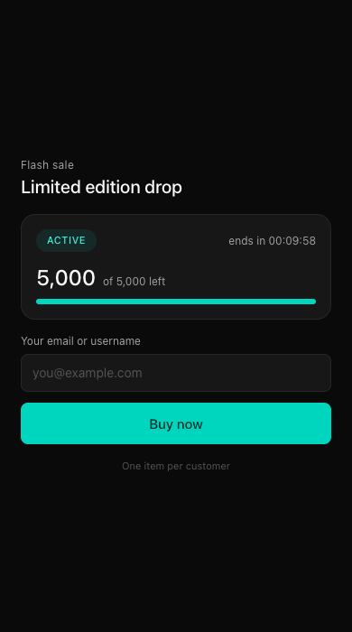
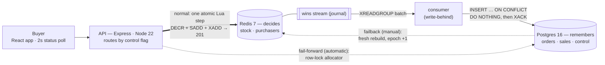
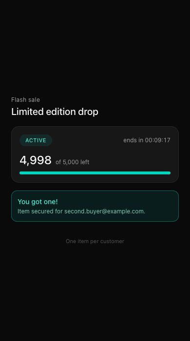
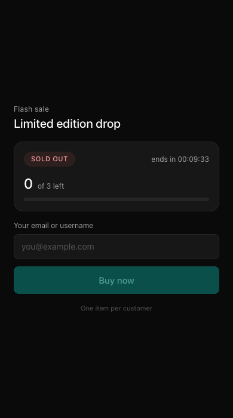

# Flash Sale System

A high-throughput flash sale backend + React storefront: **one product, limited stock, one item per user, zero overselling** — proven under 10,000 concurrent buyers, with **durable orders that survive a total Redis loss** and a sale that **keeps selling through a Redis death** via automatic Postgres failover.

The design reduces to three ideas:

1. Every stock mutation happens inside a single **atomic Redis Lua script**, so the race condition that causes overselling cannot exist.
2. **Redis decides, Postgres remembers** — the same script journals each win to a Redis Stream, a write-behind consumer drains it into Postgres, and Redis state is rebuildable from Postgres after a disaster.
3. **Exactly one decider at a time** — a control flag (a Postgres row) picks who decides each request. Redis normally; Postgres when Redis dies. Failing over is automatic, coming back is a deliberate human step.



## Architecture



Solid arrows are normal operation; the two dashed arrows are the failure story. When Redis dies, the API **fails forward** — the same request is decided in Postgres, and the buyer still gets a 201. Coming back is a **manual failback** that rebuilds a fresh Redis from Postgres. Both are covered below.

The API tier is deliberately **stateless** — sale window, stock, and purchaser records all live in Redis. Any number of API instances can run behind a load balancer without changing correctness, because the single point of coordination is the Lua script below. Postgres sits **off the hot path**: buyers get their answer from the Redis decision alone, and the consumer makes each win durable milliseconds later.

## How overselling is prevented

Redis executes a Lua script as one uninterruptible unit — no other command can interleave. The purchase decision ("has this user bought? is there stock? decrement and record") is therefore a single indivisible step:

```lua
-- KEYS[1] = stock counter, KEYS[2] = purchasers set, KEYS[3] = wins stream
-- ARGV[1] = user id, ARGV[2] = sale id
if redis.call('SISMEMBER', KEYS[2], ARGV[1]) == 1 then
  return 'ALREADY_PURCHASED'
end
local stock = tonumber(redis.call('GET', KEYS[1]))
if stock == nil then return 'NOT_INITIALIZED' end
if stock <= 0 then return 'SOLD_OUT' end
redis.call('DECR', KEYS[1])
redis.call('SADD', KEYS[2], ARGV[1])
redis.call('XADD', KEYS[3], '*', 'userId', ARGV[1], 'saleId', ARGV[2])
return 'PURCHASED'
```

Two requests can never both read `stock = 1` and both decrement — Redis is single-threaded and the script is atomic, so requests serialize at in-memory speed (µs per op). Because `DECR`, `SADD`, and the `XADD` journal write happen in the same script, a crash can never split them into partial state — there is no dual-write gap between "the stock went down" and "the win was recorded."

**Idempotency for free:** the user id is the natural idempotency key. A client that times out after a successful purchase simply retries and receives `ALREADY_PURCHASED` — stock is never decremented twice. Identifiers are normalized (trim + lowercase) before validation, so `User@X.com ` and `user@x.com` cannot bypass the one-per-user rule.

## Durable orders — Redis decides, Postgres remembers

Redis is a superb decision-maker and a poor system of record, so the design splits the roles with **async write-behind**:

- The Lua script above `XADD`s every win to a Redis Stream *in the same atomic unit* as the decrement — no queue broker, no dual write.
- A small **consumer process** drains the stream in batches: `XREADGROUP` → one multi-row `INSERT … ON CONFLICT (sale_id, user_id) DO NOTHING` transaction → `XACK`. Delivery is at-least-once; the unique constraint turns replays into no-ops, so the *effect* is exactly-once. A crash at any point — before the insert, mid-transaction, or in the classic gap between commit and ack — is recovered by redelivery.
- The buyer never waits on Postgres: the 201 is returned on the Redis decision (buyer-facing latency is unchanged), and the win is durable in Postgres within the drain lag (milliseconds with a live consumer).

**The durability ladder for an acknowledged 201** (each failure mode priced honestly):

| Failure | Acknowledged wins lost |
|---|---|
| Redis process restart | **None** — stream + consumer-group state are ordinary Redis data covered by AOF; the consumer resumes draining |
| Host/power crash | ≤1s (`appendfsync everysec` window) |
| Redis volume loss / AOF corruption | Only wins not yet drained to Postgres (~drain lag) — the scenario write-behind exists for |

If a stronger guarantee were required (wins are money, not demo items), the next rungs are: wait for the durable order row before returning 201, `appendfsync always`, or replica `WAIT` — each trades hot-path latency or availability for a smaller window.

**Disaster recovery.** `npm run rebuild` reconstructs Redis entirely from Postgres: the `sales` row restores initial stock and the sale window, the `orders` rows restore the purchasers set, and the stock counter is computed and written **last** — so a rebuild that crashes halfway leaves the sale closed (`503`), never oversellable. Drill (performed end-to-end, all invariants green):

```bash
docker compose rm -sf redis && docker volume rm flash-sale-redis-data
docker compose up -d redis    # brand-new, empty Redis
npm run rebuild               # restores stock, purchasers, window from Postgres
npm run verify                # PASS — pre-loss winners still get ALREADY_PURCHASED
```

Known, accepted trade-offs of the async design: a dead consumer silently widens the exposure window (mitigated: `verify` fails loudly when the stream isn't drained; production would alarm on `XINFO GROUPS` lag), and the untrimmed stream grows for the life of a sale (deliberate — it doubles as an audit log; production policy is `XTRIM MINID` after ack).

## Availability — the sale survives a Redis death

Durability answers "Redis lost its data"; availability answers "Redis is *gone* mid-sale". A `control` flag (a Postgres row, read per request behind a ~1s cache) chooses the decider — `redis`, `postgres`, or the transient `cutover`.

**Fail-forward is automatic.** When a Redis call throws, the API flips the flag to `postgres` and decides the *same request* against an atomic Postgres allocator (`UPDATE … SET remaining = remaining - 1 WHERE remaining > 0 RETURNING`, plus the order insert, in one transaction — row locking gives the same can't-both-pass guarantee the Lua script does). The buyer gets a 201 and never sees the outage. The status endpoint fails forward too, which matters more than it sounds: the buyer's page only *polls* — if reads didn't flip the flag, a dead Redis would leave every poll at 503 with the Buy button disabled, and nobody could even click to trigger the failover. As built, the page heals itself within one 2-second poll.

**The fallback starts warm.** The same atomic flip reconciles Postgres's counter from the orders the consumer has already drained (`remaining = initial_stock − count(orders)`), so Postgres takes over from the true count. The residual exposure is only the wins still in flight in the drain at the instant Redis died — bounded by consumer lag, and asserted from both sides by the failover money test (cold fallback re-sells) and the warm-fallback test (drained fallback doesn't).

**Failback is deliberately manual.** "Redis is reachable again" does not mean "Redis is trustworthy again" — it may be empty, stale, or flapping. `npm run failback` rebuilds a **fresh** Redis from Postgres (bulk pass while Postgres keeps serving, then a small catch-up delta), *parks* new purchases in memory for a sub-second cutover instead of rejecting them, and flips the flag back at **epoch + 1**. The epoch is a fencing token stamped into the rebuilt Redis: an API instance that finds a mismatched epoch refuses that Redis and fails forward — a stale generation can never decide again.

Sixty-second demo:

```bash
docker compose stop redis                 # kill Redis mid-sale
curl -s localhost:3000/healthcheck        # "decider":"postgres" — flipped itself
# buys keep returning 201; the storefront recovers on its own next poll
npm run verify:pg                         # invariants hold against Postgres alone
docker compose start redis
npm run failback                          # rebuild → park → delta → flip, epoch +1
```

`FALLBACK=off` starts the server Redis-only (no pool, no failover) — an operational kill-switch, and a way to see the difference: with it off, the same `docker stop` kills the sale. Design record and trade-offs: [docs/design.md](docs/design.md).

## API

| Route | Purpose |
|---|---|
| `GET /healthcheck` | Liveness, which store is deciding (`decider`), and whether the Postgres fallback is wired (`fallback`) — `503` when degraded |
| `GET /api/sale/status` | `{ status, startsAt, endsAt, serverTime, stockRemaining, initialStock, soldOut }` |
| `POST /api/purchase` `{ userId }` | Attempt a purchase (see outcomes) |
| `GET /api/purchase/:userId` | `{ userId, purchased }` |

`POST /api/purchase` outcomes:

| HTTP | `code` | Meaning |
|---|---|---|
| 201 | `PURCHASED` | Item secured |
| 200 | `ALREADY_PURCHASED` | Same user retried — idempotent, no second item |
| 409 | `SOLD_OUT` | Stock exhausted |
| 403 | `SALE_NOT_STARTED` / `SALE_ENDED` | Outside the sale window |
| 400 | `VALIDATION_ERROR` | Bad `userId`, malformed JSON, or body too large (413 for oversized) |
| 503 | `SERVICE_UNAVAILABLE` | Redis unreachable or sale not seeded — always safe to retry |

All rules are enforced server-side; the frontend's disabled states are cosmetic.

## Running locally

Prerequisites: **Node 22+** and **Docker** (Redis and k6 both run in containers — nothing else to install).

```bash
cp .env.example .env       # defaults: 5,000 stock, 10-minute sale window
npm install
docker compose up -d       # Redis 7 + Postgres 16, both with healthchecks
npm run migrate            # create the sales + orders tables (idempotent)
npm run seed               # stock + sale window in Redis, sale record in Postgres
npm run dev                # API on :3000, web on :5173
npm run dev:consumer       # write-behind consumer (separate terminal)
```

Open http://localhost:5173 — enter any identifier and hit **Buy now**. To restart the sale after it ends or sells out, re-run `npm run seed -- --force` (stop the consumer first — it may hold pending entries from the old run).

## Testing

```bash
npm test          # 46 tests, all against real Redis + Postgres (docker compose)
```

- **Lua script semantics** — every outcome of the atomic core, including the stream-journal behavior on each one (a win appends exactly one entry; nothing else appends anything).
- **Concurrency (the money test, both deciders)** — 100 users fire 500 simultaneous requests (5 attempts each) at 25 items: asserts *exactly* 25 `PURCHASED`, 25 unique purchasers, stock exactly 0, never negative. Run against Redis, against the Postgres allocator alone, and through the full HTTP stack with the flag on `postgres`.
- **API contract** — every outcome row above, identifier normalization, table-driven input validation, unseeded → 503, and fail-fast when Redis is unreachable with no fallback wired (`enableOfflineQueue: false`, so calls fail instead of hanging).
- **Write-behind consumer** — drains wins into Postgres and acks; deliberately "crashes" between the insert commit and the ack, then proves the redelivery inserts zero duplicates.
- **Disaster recovery** — wipes the sale from Redis, rebuilds it from Postgres, and proves the restored state enforces the same invariants (pre-loss winners deduped, remaining stock sells to exactly zero); refuses to rebuild from an inconsistent store.
- **Failover** — a dead Redis fails purchases *and* status reads forward to Postgres transparently; a business `SOLD_OUT` never flips the flag; the epoch fence rejects a stale Redis and admits a correctly stamped one; failback refuses to run unless the sale is actually failed forward.
- **The failover pair** — the failover money test proves the deliberate cold-fallback re-sell; the warm-fallback test proves a drained consumer closes it.

## Stress test

10,000 unique users race for 5,000 items, then all 10,000 retry — a scenario chosen because its expected outcome is fully deterministic:

```bash
npm run seed -- --force    # reset to full stock
npm run stress             # k6 via Docker (grafana/k6), no local install
npm run verify             # invariant checker reads Redis + k6 summary
```

| Wave | Expected | Observed |
|---|---|---|
| Race: 10,000 users, 5,000 items | exactly 5,000 × `201`, 5,000 × `409` | 5,000 / 5,000 |
| Retry: same 10,000 users again | exactly 5,000 × `200`, 5,000 × `409`, **zero** new `201` | 5,000 / 5,000 / 0 |
| Uncontracted responses | 0 | 0 |
| p95 latency (500 concurrent VUs) | < 200 ms | ~26 ms (with the journal write in the hot path) |
| Throughput | — | ~8,000 req/s on a laptop (race wave: 10,000 requests in ~1.2 s) |

`verify.ts` then asserts the full deterministic contract — the window was active for the whole run (zero 403s), exactly `min(users, stock)` = 5,000 purchases, wave-2 idempotency (5,000 ALREADY_PURCHASED, zero new wins), loser counts, zero uncontracted responses — and cross-checks both stores: stock ≥ 0, `purchasers set size == 5,000 == initial − remaining`, and (after waiting for the consumer to fully drain) that **Postgres holds exactly one order per winner, for exactly the same set of winners Redis has**. A run that silently did nothing fails verification, and so does a dead or lagging consumer.

## Design choices & trade-offs

**Why Redis (not a relational DB) for the hot path.** A flash sale spike is thousands of concurrent writes to *one* value — the worst case for row locking. Postgres can do this correctly (`UPDATE … WHERE stock > 0` + a unique constraint), but 10k concurrent updates on one row form a lock queue, hold connections, and degrade exactly at peak. Redis serializes the same contention in memory at microsecond cost — its single-threaded model is precisely what the workload needs. The trade-off is durability: Redis is not a system of record (see scaling section).

**Why Express.** Chosen for team familiarity and ecosystem maturity — and because the API tier is stateless, throughput scales horizontally regardless of framework. If single-node throughput became the bottleneck, the first moves would be Node cluster mode or Fastify (~2–3× router/serialization throughput); the Redis coordination layer wouldn't change at all.

**Why the sale window lives in Redis** (seeded from env). Every instance shares one source of truth and the sale can be re-seeded without a restart. The window is read fresh per request — one O(1) `MGET`, deliberately uncached: the API tier saturates long before Redis, so a cache would buy nothing and cost staleness after a reseed.

**Fail fast over queue-and-pray.** `enableOfflineQueue: false` — when Redis is down, requests get an immediate `503 (safe to retry)` instead of piling up in memory while thousands of buyers hammer the API.

**Window enforcement is best-effort at the boundary.** The sale-window check runs in Node, then the atomic purchase runs in Redis — so a request that passes the check just before `endsAt` completes after it. The gap is typically sub-millisecond but is not bounded (a backlogged Redis could stretch it). This never affects inventory correctness — the Lua invariants are independent of the window — it only means a purchase can land marginally past the deadline. The strict fix is evaluating the window inside the Lua script via Redis `TIME`, trading a simpler script for an atomic boundary.

**Deliberately not built (production hardening):** the demo has no authentication — identity is a self-asserted identifier, per the brief. With real users I would add: authenticated identity (take `userId` from a session token, not the body), per-IP **rate limiting** (`express-rate-limit`) on purchases and the status-check endpoint, a restricted **CORS origin** (currently open for local dev), and auth-scoping the `GET /api/purchase/:userId` lookup so it can't be used to enumerate who participated. Also out of scope: payment/checkout and an admin panel.

## How this scales further

- **Horizontal API scaling** — instances are stateless; add an LB and N replicas, correctness unchanged.
- **Durable orders — built**: the write-behind stream + consumer + Postgres described above, with no external broker. At larger scale the same design extends naturally: multiple named consumers on the group (add `XAUTOCLAIM` to reclaim a dead consumer's pending entries), a dead-letter parking spot for poison batches, and `XTRIM MINID` after ack to bound stream memory.
- **Redis availability** — replica + failover (or managed Redis) on top of the bundled AOF; before *confirming* a winner you'd require an acknowledgement level (AOF fsync, replica `WAIT`, or waiting on the durable order row) matched to how much loss is tolerable. Both the purchasers set and the orders unique constraint make recovery idempotent. Cluster note: the multi-key script needs hash-tagged keys (`sale:{id}:…`) so all three keys share a slot.
- **Spike absorption** — if traffic exceeds synchronous capacity, queue purchase attempts and confirm asynchronously.
- **Cheap first mitigations** — per-IP rate limiting, CDN caching of the status endpoint (it's identical for every user within a second).

## Screenshots

| Active sale | Item secured | Sold out |
|---|---|---|
|  |  |  |
