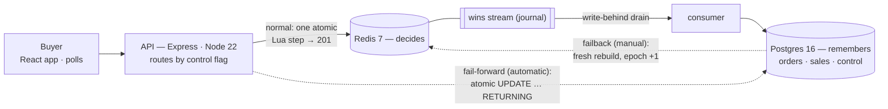

# Design — Postgres fallback decider and safe manual failback

Durability (the write-behind store) answers "what if Redis loses its data?"
This document covers the follow-up: **what if the whole Redis dies and stays
dead?** The goal is an availability answer — the sale keeps taking orders
while Redis is gone — without ever running two deciders at the same time.

## Architecture map



Solid arrows are the normal path. Dashed arrows are the failure story: the API
can make the purchase decision directly in Postgres when Redis is down, and
Postgres can rebuild a fresh Redis when it is time to come back. In both modes
the buyer gets the 201 from the decision itself — the answer never waits on
the other store.

## The one rule

**Exactly one decider at a time.** A `control` row in Postgres holds the
current allocator (`redis` | `postgres` | `cutover`) plus an epoch number.
Everything else in this document exists to keep that single-decider guarantee
true during transitions.

```sql
CREATE TABLE IF NOT EXISTS control (
  sale_id   text PRIMARY KEY,
  allocator text NOT NULL DEFAULT 'redis'
            CHECK (allocator IN ('redis', 'postgres', 'cutover')),
  epoch     integer NOT NULL DEFAULT 1,
  flipped_at timestamptz NOT NULL DEFAULT now()
);
```

The API reads the row per request behind a ~1s cache. The bounded staleness is
safe: both deciders are individually correct, and the failback parks traffic
for a full cache lifetime before its final flip, so a stale read never
straddles a switch.

## The Postgres allocator

The fallback decision mirrors what the Lua script does in Redis, as one
transaction:

1. `INSERT INTO orders … ON CONFLICT DO NOTHING` — a no-op means the user
   already holds an item (`ALREADY_PURCHASED`).
2. `UPDATE sales SET remaining = remaining - 1
    WHERE sale_id = $1 AND remaining > 0 RETURNING remaining` — zero rows back
   means `SOLD_OUT`, and the transaction rolls the insert back.

Row-level locking makes concurrent buyers queue on the same row, so the
`remaining > 0` guard makes overselling impossible for the same reason the Lua
script does: the check and the decrement are one indivisible step. Slower than
Redis — that is the point of having Redis — but correct on its own.

## Design decisions

**The async ack stays.** 201 comes from whichever decider made the call —
Redis in normal mode, Postgres in fallback mode. Never wait for the other
store.

**Fail-forward is automatic; failback is not.** Flipping to Postgres when
Redis dies is safe to automate — worst case the sale runs slower but stays
correct. Flipping back is a judgment call: "Redis is reachable again" does not
mean "Redis is trustworthy again" (it may be empty, stale, or flapping), and a
failback needs a pre-staged rebuild first. So the flag flips to `postgres`
automatically on a Redis failure, and only a human runs the failback.

**Reads fail forward too.** The buyer's page only polls the status endpoint.
If reads did not flip the flag, a dead Redis would leave every poll at 503,
the page would disable the buy button, and nobody could even click to trigger
the failover — the sale would look dead until someone intervened by hand. So
the status read takes the same fallback path the purchase does, and the page
heals itself within one poll.

**The fallback starts warm.** While Redis decides, it never touches Postgres's
`remaining` counter, so by failover time that counter is stale-high and a cold
fallback would re-sell items. The fail-forward therefore reconciles
`remaining = initial_stock − count(orders)` in the same atomic statement that
flips the flag, using the orders the write-behind consumer has already kept
current. The residual gap is exactly the wins the consumer had not yet drained
at the instant of failure — bounded by drain lag, not by the whole of Redis's
sales. Closing it entirely would need a synchronous ack, which is the
throughput Redis exists to avoid.

**Fencing: never re-admit a woken Redis.** If the old Redis comes back to
life, it is discarded — its data went stale the moment Postgres started
deciding. Failback always builds a **fresh** Redis from Postgres, and the new
epoch from `control` is stamped into it. An API instance that finds a
mismatched epoch stamp refuses that Redis and fails forward: a stale
generation can never decide again. The seed script stamps the epoch too, so a
reseed after a past failback starts correctly fenced.

**Parked requests live in API process memory only.** During the cutover window
the API holds new purchase requests (open socket, pending promise, small
in-process gate) instead of rejecting them. This is deliberately not durable:
a dropped park costs one idempotent retry by the buyer, which the
`UNIQUE (sale_id, user_id)` anchor makes harmless. A broker would be the wrong
fix — a dead socket cannot be answered from a broker later. The real
alternative is a different product ("accept durably, respond pending"), which
changes the buyer experience and is out of scope.

## Failback (manual, one script)

`npm run failback`, which refuses to run unless the sale is currently failed
forward:

1. **Pre-stage** — while Postgres keeps serving traffic, rebuild a fresh Redis
   from a consistent Postgres snapshot. Heavy pass, zero traffic impact.
2. **Flip to `cutover`** — API instances start parking new purchases in memory
   (hold, don't reject). In-flight Postgres decisions finish.
3. **Wait for Postgres to stop changing** — the short quiet moment that makes
   the next step exact.
4. **Catch-up pass** — copy only the orders added since the pre-stage into the
   fresh Redis. Small because step 1 did the bulk work; the two passes are
   what keep the park sub-second.
5. **Flip to `redis` at epoch + 1** — the fresh Redis is now the decider.
6. **Release the parked requests** into Redis. Buyers who waited get their
   real answer; nobody got two items and nothing oversold.

## Failure modes, priced

| Failure | What happens | Recoverable? |
|---|---|---|
| Consumer dies, Redis alive | Wins pile up safely in the stream | Yes — restart the consumer, it drains the backlog (redelivery is idempotent) |
| Redis restarts, volume intact | Stream and pending entries survive via AOF | Yes — nothing lost beyond the ~1s `appendfsync` window |
| Redis dies mid-sale, consumer healthy | Automatic fail-forward, warm reconcile | Yes — residual exposure is only in-flight drain lag |
| Redis storage lost while wins were un-drained | Those wins are gone: their buyers are forgotten and their slots re-sellable | No — this is the one accepted gap of the async ack, sized by consumer lag; consumer supervision keeps it near zero |
| Postgres lost | The durable tier itself | Out of scope — Postgres is the system of record; assume standard backups/replication |

The last two rows are the honest edges of the design. The first is why the
consumer deserves supervision in production (restart-on-crash and a lag alarm
on `XINFO GROUPS`); the second is the boundary every "fast decider, durable
follower" design shares.
